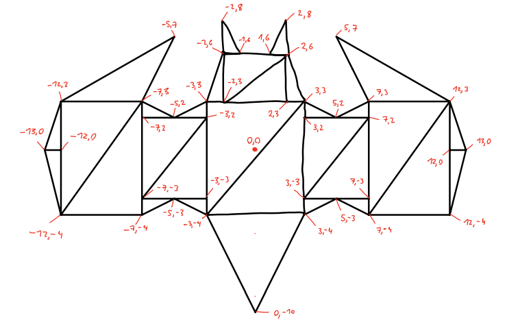
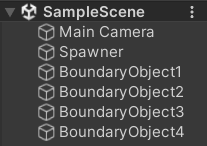
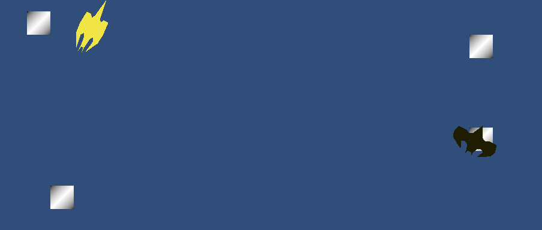

# Unity Application Report: 2D Graphics and Transformations

## Introduction

This report documents the development of a Unity application where a 2D graphical object - The Batman - is designed, created, and manipulated using custom vector and transformation functions. The application is structured into three main tasks that progressively build on the functionality of the object, including its movement, duplication, and dynamic color and size changes.

## Program Design

The application is built in Unity, using C# for scripting. The project structure includes custom classes for handling vectors and transformations, allowing for detailed control over the object's behavior.

### Project Structure

- **Materials**: Contains material files for visual properties.
- **Prefabs**: Holds the spaceship object as a prefab for easy duplication.
- **Scenes**: Contains the main scene file.
- **Scripts**: Includes custom C# scripts for vectors, transformations, and object behavior.

### Custom classes

- **IGB283Vector3.cs**: Implements vector operations like addition, subtraction, and scaling.
- **Matrix3x3.cs**: Handles matrix operations for transformations, including rotation, translation, and scaling.
- **IGB283Transform.cs**: Utilizes Matrix3x3 to apply transformations to objects.

## Creating and Displaying a 2D Object

### Review Unity Documentation on Transform

Unity's `Transform` component is central to object manipulation, handling position, rotation, and scale. Key functions include `Translate()`, `Rotate()`, and `Scale()`. This project replicates these operations using custom classes.

### Design and Create a 2D Graphical Object

A simple 2D batman siluet consisting of 31 triangles was designed using Unity's `Mesh` component. The vertices are stored in an array for manipulation.

```
private Vector3[] meshVertices = new Vector3[] {
    // Define vertices here...
};
```




### Display the Object on Screen

The object is displayed using a `MeshRenderer` component attached to a GameObject. The vertices are converted into a mesh, which is then rendered.

```
mesh = new Mesh();
mesh.vertices = meshVertices;
mesh.triangles = /* Define triangles here */;
GetComponent<MeshFilter>().mesh = mesh;
```

### Implement Custom Vector and Transformation Functions

Custom vector (`IGB283Vector3`) and transformation (`Matrix3x3`, `IGB283Transform`) classes were implemented to handle typical vector operations and transformations like translation, rotation, and scaling.

### Rotating and Translating the Object

The object is made to rotate continuously and translate between two points. This is achieved by applying the custom `IGB283Transform` functions in the `Update()` method.

## Duplication and Boundary Interaction

### Duplicate the Spinning and Bouncing Object

The object is duplicated using a spawner script, with each copy having independent spinning and bouncing rates.

### Add Boundary Objects

Four small squares are placed at the boundary points where the objects reverse their translation direction, representing space stations.



## Dynamic Color and Size Changes

### Change Color Based on Position

The object's color changes dynamically based on its position between the two bounce points. A linear interpolation (`Lerp`) is used to calculate the color.

### Change Size Based on Position

Similarly, the object's size changes based on its position, using custom implemented `Lerp` for smooth transitions.



## User Instructions

1. **Run the Scene**: Open the SampleScene in Unity and press the Play button.
2. **Observe the Objects**: Watch as the objects spin, bounce between points, and interact with boundary objects.
3. **Color and Size Changes**: Note the dynamic changes in color and size as the objects move.

## Video preview

[Youtube](https://youtu.be/0GVzdd1fXsc)

## Conclusion

This Unity application showcases the use of custom vector and transformation functions to create and manipulate 2D objects. The tasks demonstrate a progression from basic object creation and display to more complex interactions involving multiple objects and dynamic properties.
